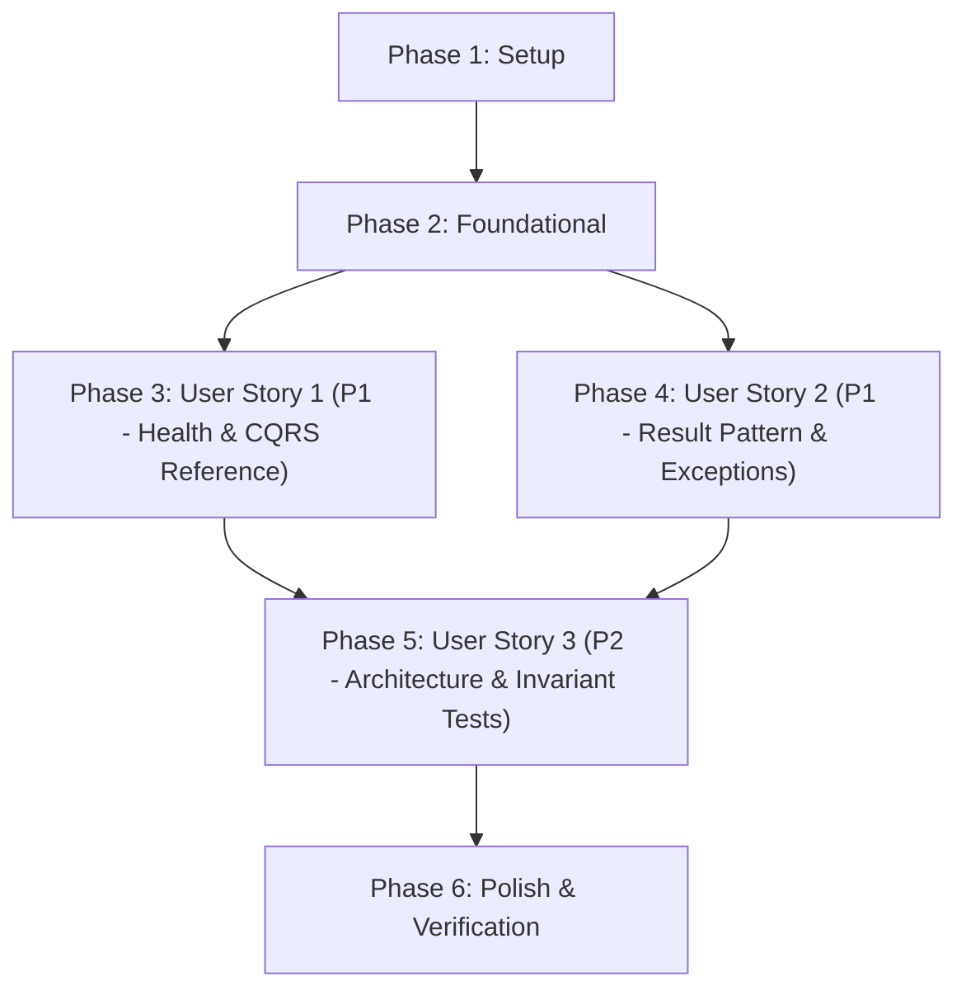

# Tasks: Backend Initial Architecture Setup

**Input**: Design documents from `specs/001-backend-initial-setup/` (`spec.md`, `plan.md`, `data-model.md`, `research.md`, `contracts/`, `quickstart.md`)  
**Prerequisites**: `plan.md` (required), `spec.md` (required), `data-model.md`, `contracts/`, `research.md`, `quickstart.md`  
**Constitution**: Constitution v1.2.0 (`.specify/memory/constitution.md`)  

---

## Phase 1: Setup (Shared Infrastructure)

**Purpose**: Solution and project structure initialization for .NET 10 Clean Architecture.

- [ ] T001 Initialize solution file and directory structure in `backend/Pqrsdf.sln`
- [ ] T002 [P] Create Domain project targeting net10.0 in `backend/src/Domain/Pqrsdf.Domain.csproj`
- [ ] T003 [P] Create Application project targeting net10.0 with MediatR in `backend/src/Application/Pqrsdf.Application.csproj`
- [ ] T004 [P] Create Infrastructure project targeting net10.0 with EF Core SQL Server in `backend/src/Infrastructure/Pqrsdf.Infrastructure.csproj`
- [ ] T005 [P] Create API project targeting net10.0 in `backend/src/Api/Pqrsdf.Api.csproj`
- [ ] T006 [P] Create test projects targeting net10.0 in `backend/tests/Domain.UnitTests/Pqrsdf.Domain.UnitTests.csproj`, `backend/tests/Application.UnitTests/Pqrsdf.Application.UnitTests.csproj`, and `backend/tests/Architecture.Tests/Pqrsdf.Architecture.Tests.csproj`
- [ ] T007 Link all projects to solution and configure `<TreatWarningsAsErrors>true</TreatWarningsAsErrors>` in `backend/Pqrsdf.sln`

---

## Phase 2: Foundational (Blocking Prerequisites)

**Purpose**: Core domain primitives, Result pattern, and persistence baseline required across all user stories.

**⚠️ CRITICAL**: No user story work can begin until this phase is complete.

- [ ] T008 [P] Implement base entity and aggregate root marker in `backend/src/Domain/Shared/Entities/Entity.cs` and `backend/src/Domain/Shared/Entities/IAggregateRoot.cs`
- [ ] T009 [P] Implement base value object marker using C# record in `backend/src/Domain/Shared/ValueObjects/ValueObject.cs`
- [ ] T010 [P] Implement domain event abstraction in `backend/src/Domain/Shared/Events/IDomainEvent.cs`
- [ ] T011 [P] Implement Spanish domain messages and error catalogs in `backend/src/Domain/Constants/DomainMessages.cs`
- [ ] T012 [P] Implement ErrorType enum and Error record in `backend/src/Domain/Shared/Results/ErrorType.cs` and `backend/src/Domain/Shared/Results/Error.cs`
- [ ] T013 Implement Result and Result<T> primitives in `backend/src/Domain/Shared/Results/Result.cs`
- [ ] T014 Configure Entity Framework Core DbContext with SQL Server in `backend/src/Infrastructure/Persistence/PqrsdfDbContext.cs` and `backend/src/Infrastructure/DependencyInjection.cs`
- [ ] T015 [P] Configure Application dependency injection and MediatR handlers in `backend/src/Application/DependencyInjection.cs`
- [ ] T016 Configure API configuration files and base builder in `backend/src/Api/appsettings.json`, `backend/src/Api/appsettings.Development.json`, and `backend/src/Api/Program.cs`

**Checkpoint**: Foundation ready - user story implementation can now proceed.

---

## Phase 3: User Story 1 - Backend Health and Operational Status Verification (Priority: P1) 🎯 MVP

**Goal**: Deliver operational health probes and an end-to-end reference CQRS query (`GetSystemStatus`) demonstrating the mandatory co-located folder structure.

**Independent Test**: Execute `curl http://localhost:5155/health` and `curl http://localhost:5155/api/v1/system/status` verifying HTTP 200 OK responses adhering to `contracts/system-status-contract.json`.

### Tests for User Story 1
- [ ] T017 [P] [US1] Create unit tests for system status query handler in `backend/tests/Application.UnitTests/Features/System/GetSystemStatusQueryHandlerTests.cs`

### Implementation for User Story 1
- [ ] T018 [P] [US1] Create SystemStatusDto record in `backend/src/Application/Features/System/UseCases/GetSystemStatus/SystemStatusDto.cs`
- [ ] T019 [US1] Create GetSystemStatusQuery record in `backend/src/Application/Features/System/UseCases/GetSystemStatus/GetSystemStatusQuery.cs`
- [ ] T020 [US1] Implement GetSystemStatusQueryHandler in `backend/src/Application/Features/System/UseCases/GetSystemStatus/GetSystemStatusQueryHandler.cs`
- [ ] T021 [US1] Configure health checks middleware with SQL Server check in `backend/src/Api/Program.cs`
- [ ] T022 [US1] Implement SystemController exposing GET /api/v1/system/status in `backend/src/Api/Controllers/V1/SystemController.cs`

**Checkpoint**: User Story 1 is functional and independently verifiable as the core MVP.

---

## Phase 4: User Story 2 - Standardized Operation Result and Error Reporting (Priority: P1)

**Goal**: Standardize HTTP responses via `Result<T>` mapping and capture unhandled exceptions with RFC 7807 `ProblemDetails` in Spanish without leaking stack traces.

**Independent Test**: Verify that valid requests return standard result envelopes, business errors return structured bad requests in Spanish, and unhandled errors return RFC 7807 problem details per `contracts/problem-details-contract.json`.

### Tests for User Story 2
- [ ] T023 [P] [US2] Create unit tests for Result and Error records in `backend/tests/Domain.UnitTests/Shared/Results/ResultTests.cs`

### Implementation for User Story 2
- [ ] T024 [US2] Implement ApiControllerBase translating Result<T> to ActionResult in `backend/src/Api/Shared/Controllers/ApiControllerBase.cs`
- [ ] T025 [US2] Implement GlobalExceptionHandler implementing IExceptionHandler in `backend/src/Api/Shared/Middleware/GlobalExceptionHandler.cs`
- [ ] T026 [US2] Register GlobalExceptionHandler and ProblemDetails in `backend/src/Api/Program.cs`
- [ ] T027 [US2] Add simulated error endpoint for validation in `backend/src/Api/Controllers/V1/SystemController.cs`

**Checkpoint**: User Story 2 is functional; result translation and exception interception operate across all endpoints.

---

## Phase 5: User Story 3 - Architectural Separation of Commands and Queries (Priority: P2)

**Goal**: Enforce clean separation of Commands/Queries, value object immutability, and layer dependency rules via automated architectural tests.

**Independent Test**: Run `dotnet test backend/tests/Architecture.Tests/` asserting that Domain has zero external dependencies, Application depends only on Domain, and CQRS conventions are respected.

### Tests for User Story 3
- [ ] T028 [P] [US3] Create unit tests for ValueObject record equality and immutability in `backend/tests/Domain.UnitTests/Shared/ValueObjects/ValueObjectTests.cs`
- [ ] T029 [P] [US3] Implement Clean Architecture layer dependency tests using NetArchTest in `backend/tests/Architecture.Tests/ArchitectureTests.cs`
- [ ] T030 [US3] Implement CQRS naming and co-location convention tests in `backend/tests/Architecture.Tests/CqrsConventionTests.cs`

**Checkpoint**: All three user stories are complete and architectural compliance is automated.

---

## Phase 6: Polish & Cross-Cutting Concerns

**Purpose**: Solution-wide build verification, test suite execution, and documentation review.

- [ ] T031 Run solution-wide build enforcing zero warnings in `backend/Pqrsdf.sln`
- [ ] T032 Execute all unit, integration, and architecture test suites in `backend/tests/`
- [ ] T033 Execute end-to-end validation scenarios following `specs/001-backend-initial-setup/quickstart.md`

---

## Dependencies & Execution Order

### Phase Dependencies
- **Setup (Phase 1)**: No dependencies — can start immediately.
- **Foundational (Phase 2)**: Depends on Setup completion — BLOCKS all user stories.
- **User Story 1 (Phase 3)**: Depends on Foundational phase completion (MVP).
- **User Story 2 (Phase 4)**: Depends on Foundational phase completion; integrates with User Story 1 controllers.
- **User Story 3 (Phase 5)**: Depends on Foundational and User Story 1/2 completion to validate architectural rules against actual classes.
- **Polish (Phase 6)**: Depends on all user stories being complete.

### User Story Dependencies

---

## Parallel Opportunities

- **Phase 1**: T002, T003, T004, T005, T006 can run in parallel.
- **Phase 2**: T008, T009, T010, T011, T012, T015 can run in parallel.
- **Phase 3**: T017 (Unit tests) and T018 (DTO record) can run in parallel.
- **Phase 4**: T023 (Result tests) can run in parallel with middleware preparation.
- **Phase 5**: T028 (ValueObject tests) and T029 (NetArchTest) can run in parallel.

---

## Implementation Strategy

### MVP First (User Story 1 Only)
1. Complete Phase 1 (Setup) and Phase 2 (Foundational).
2. Complete Phase 3 (User Story 1).
3. **Validate**: Run `GET /health` and `GET /api/v1/system/status`. The CQRS and Clean Architecture baseline is established and proven.

### Incremental Delivery
1. Foundation (Phase 1 & 2) → Infrastructure ready.
2. User Story 1 (Phase 3) → Operational verification & reference CQRS slice running.
3. User Story 2 (Phase 4) → Standardized Result translation and RFC 7807 ProblemDetails active.
4. User Story 3 (Phase 5) → NetArchTest automated guardrails protecting against architectural regressions.
5. Polish (Phase 6) → Complete solution build and quickstart verification.
