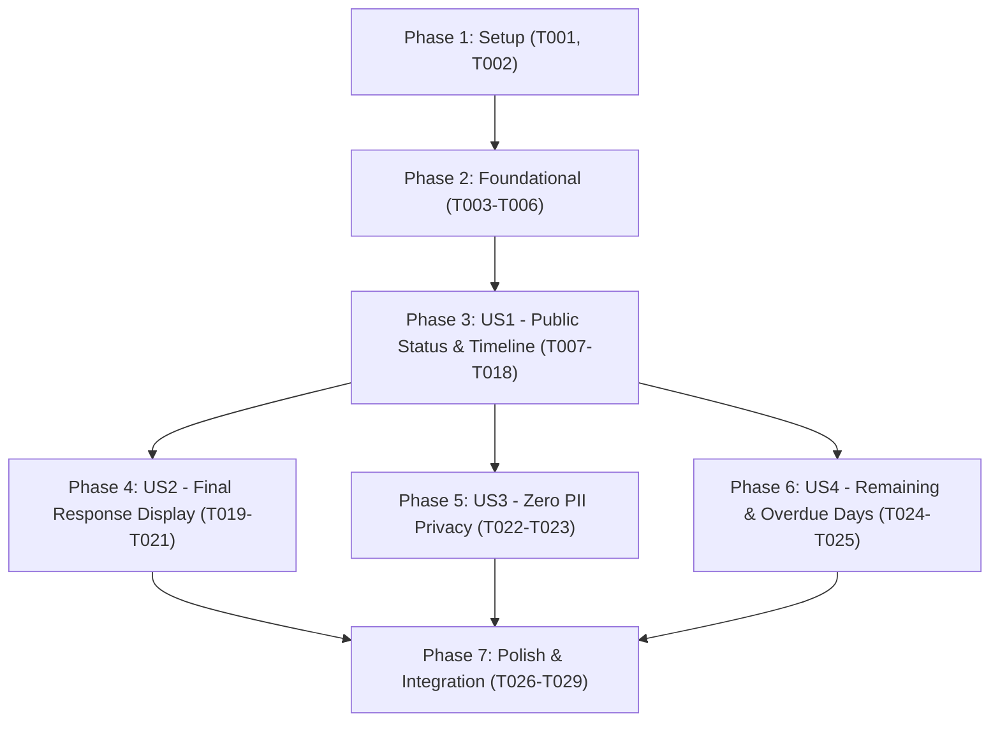

# Tasks: Public PQRSDF Ticket Consultation (004-pqrsdf-get-ticket)

**Input**: Design documents from `specs/004-pqrsdf-get-ticket/` (`spec.md`, `plan.md`, `data-model.md`, `research.md`, `contracts/`, `quickstart.md`)  
**Prerequisites**: `plan.md` (complete), `spec.md` (complete), `data-model.md` (complete), `contracts/` (complete), `quickstart.md` (complete)  
**Organization**: Tasks are grouped by user story to enable independent implementation and testing of each story.

## Format: `[ID] [P?] [Story] Description`
- **[P]**: Can run in parallel (different files, no blocking dependencies)
- **[Story]**: Which user story this task belongs to (`US1`, `US2`, `US3`, `US4`)
- Includes exact file paths in all descriptions

---

## Phase 1: Setup (Shared Infrastructure)

**Purpose**: Project initialization, rate limiter configuration, and message localization

- [ ] T001 Add Spanish message keys for ticket consultation, timeline stages, status badges, overdue alerts, and final resolution in `frontend/messages/es.json`
- [ ] T002 [P] Configure IP-based rate limiting (30 req/min) with `FixedWindowLimiter` and 429 response handling in `backend/src/Api/Program.cs`

---

## Phase 2: Foundational (Blocking Prerequisites)

**Purpose**: Core domain evolution, repository mappings, and SLA business days calculation that block user story implementation

- [ ] T003 Evolve `PqrsdfTicket` aggregate root with `ResponseText`, `ResponseDateUtc`, and domain method `CloseWithResponse` in `backend/src/Domain/Entities/PqrsdfTicket.cs`
- [ ] T004 [P] Update EF Core configuration for nullable `ResponseText` and `ResponseDateUtc` mappings in `backend/src/Infrastructure/Persistence/Configurations/PqrsdfTicketConfiguration.cs`
- [ ] T005 [P] Extend `DueDateCalculator` with `CalculateRemainingBusinessDays` and `CalculateOverdueBusinessDays` in `backend/src/Domain/Services/DueDateCalculator.cs`
- [ ] T006 [P] Unit tests for remaining and overdue business day calculations across calendar dates and holidays in `backend/tests/Application.UnitTests/Domain/DueDateCalculatorRemainingDaysTests.cs`

**Checkpoint**: Aggregate root evolved and business day SLA calculation verified.

---

## Phase 3: User Story 1 - Public Status and Timeline Consultation by Radicado Number (Priority: P1) 🎯 MVP

**Goal**: Allow unauthenticated citizens to enter their radicado number (`YYYY-NNNNNNNN`), validate format, and view ticket metadata, filing/due dates, original subject/description, and visual progress timeline without exposing personal data.

**Independent Test**: Can be tested by navigating to `/pqrsdf/search`, entering an existing radicado number (e.g., `2026-00000001`), and verifying that status, dates, subject, description, and the progress timeline render accurately in < 2 seconds.

### Tests for User Story 1
- [ ] T007 [P] [US1] Unit tests for `GetTicketByRadicadoQueryHandler` (valid ticket, non-existent ticket 404, malformed radicado 400) in `backend/tests/Application.UnitTests/Features/Pqrsdf/GetTicketByRadicadoQueryHandlerTests.cs`

### Implementation for User Story 1
- [ ] T008 [P] [US1] Create `PublicTicketStatusDto`, `TicketTimelineMilestoneDto`, and `TicketResolutionDto` in `backend/src/Application/Features/Pqrsdf/UseCases/GetTicketByRadicado/PublicTicketStatusDto.cs`
- [ ] T009 [P] [US1] Create `GetTicketByRadicadoQuery` record in `backend/src/Application/Features/Pqrsdf/UseCases/GetTicketByRadicado/GetTicketByRadicadoQuery.cs`
- [ ] T010 [US1] Implement `GetTicketByRadicadoQueryHandler` orchestrating repository retrieval, area resolution, milestone timeline generation, and DTO projection in `backend/src/Application/Features/Pqrsdf/UseCases/GetTicketByRadicado/GetTicketByRadicadoQueryHandler.cs`
- [ ] T011 [US1] Expose `GET /api/v1/pqrsdf/{radicado}` with `[EnableRateLimiting("PublicTrackingPolicy")]` in `backend/src/Api/Controllers/V1/PqrsdfController.cs`
- [ ] T012 [P] [US1] Add `getTicketByRadicado` method in `frontend/src/shared/api/client.ts`
- [ ] T013 [P] [US1] Create `TicketSearchBox` component with regex validation (`^\d{4}-\d{8}$`), auto-trim, and clear button in `frontend/src/app/pqrsdf/search/components/TicketSearchBox.tsx`
- [ ] T014 [P] [US1] Create `TicketStatusHeader` component rendering radicado, category, destination area, and status badge in `frontend/src/app/pqrsdf/search/components/TicketStatusHeader.tsx`
- [ ] T015 [P] [US1] Create `TicketDetailCard` component displaying original plain text Subject and Description in `frontend/src/app/pqrsdf/search/components/TicketDetailCard.tsx`
- [ ] T016 [P] [US1] Create `TicketTimeline` component rendering visual milestone stepper (*Registrado*, *Asignado*, *En trámite*, *Respondido*, *Cerrado*) with localized dates in `frontend/src/app/pqrsdf/search/components/TicketTimeline.tsx`
- [ ] T017 [US1] Implement `useTicketSearch` hook managing search state, API query execution, error messaging, and URL parameter sync in `frontend/src/app/pqrsdf/search/hooks/useTicketSearch.ts`
- [ ] T018 [US1] Implement public consultation page at `/pqrsdf/search` orchestrating search box, status header, details, and timeline in `frontend/src/app/pqrsdf/search/page.tsx`

**Checkpoint**: Core public consultation and timeline visualization functional.

---

## Phase 4: User Story 2 - Final Response and Closure Details Display (Priority: P1)

**Goal**: Display official institutional response text and closure date directly in the consultation view when the ticket has reached a resolved state (*Respondido* or *Cerrado*).

**Independent Test**: Can be tested by querying a radicado for a closed or answered ticket and asserting that the official response text and resolution timestamp are rendered prominently.

### Tests for User Story 2
- [ ] T019 [P] [US2] Unit test verifying `GetTicketByRadicadoQueryHandler` maps `Resolution` object when ticket is closed or answered in `backend/tests/Application.UnitTests/Features/Pqrsdf/GetTicketByRadicadoResolutionTests.cs`

### Implementation for User Story 2
- [ ] T020 [P] [US2] Create `TicketResolutionCard` component displaying official response text, resolution date, and closure icon in `frontend/src/app/pqrsdf/search/components/TicketResolutionCard.tsx`
- [ ] T021 [US2] Conditionally render `TicketResolutionCard` in `frontend/src/app/pqrsdf/search/page.tsx` when `ticket.resolution` is present

**Checkpoint**: Final resolution text displayed for closed tickets.

---

## Phase 5: User Story 3 - Absolute Applicant Privacy and Data Protection (Zero PII Exposure) (Priority: P1)

**Goal**: Safeguard citizen privacy by ensuring 0% of applicant personally identifiable information (name, document type, document number, email, phone) is exposed in public query models or API payloads.

**Independent Test**: Can be tested by querying both identified and anonymous tickets and verifying that the serialized JSON payload contains strictly 0 applicant contact fields.

### Tests for User Story 3
- [ ] T022 [P] [US3] Unit test asserting reflection scan on `PublicTicketStatusDto` contains 0 properties related to applicant name, document, email, or phone in `backend/tests/Application.UnitTests/Features/Pqrsdf/PublicTicketStatusPrivacyTests.cs`
- [ ] T023 [US3] API contract test verifying `GET /api/v1/pqrsdf/{radicado}` response body omits all applicant PII in `backend/tests/Application.UnitTests/Api/PqrsdfApiPrivacyTests.cs`

**Checkpoint**: 0% PII exposure verified across model and API contract.

---

## Phase 6: User Story 4 - Statutory Remaining Days and Expiration Alerting (Priority: P2)

**Goal**: Calculate and display exact remaining Colombian business days for active tickets, and display an explicit "Vencida" warning badge with elapsed business days in mora when the statutory deadline has expired.

**Independent Test**: Can be tested by consulting tickets with future due dates (asserting positive remaining days) and tickets with past due dates (asserting overdue badge and elapsed mora days).

### Tests for User Story 4
- [ ] T024 [P] [US4] Unit tests in `backend/tests/Application.UnitTests/Features/Pqrsdf/GetTicketByRadicadoOverdueTests.cs` verifying `RemainingBusinessDays`, `IsOverdue`, and `OverdueBusinessDays` mappings for in-term and overdue states

### Implementation for User Story 4
- [ ] T025 [US4] Update `TicketStatusHeader` to render dynamic remaining days counter and prominent overdue warning badge (*"Vencida hace X días hábiles"*) in `frontend/src/app/pqrsdf/search/components/TicketStatusHeader.tsx`

**Checkpoint**: Statutory countdown and mora alerts operational.

---

## Phase 7: Polish & Cross-Cutting Concerns

**Purpose**: Navigation integrations, deep-linking verification, and end-to-end test execution

- [ ] T026 Add direct link button to `/pqrsdf/search?radicado={radicado}` on the registration confirmation receipt in `frontend/src/app/pqrsdf/components/ConfirmationReceipt.tsx`
- [ ] T027 [P] Add navigation link to `/pqrsdf/search` in the portal home cards in `frontend/src/app/page.tsx` and main navbar in `frontend/src/app/layout.tsx`
- [ ] T028 [P] Component and user interaction tests for `/pqrsdf/search` page in `frontend/tests/app/pqrsdf/search/TicketSearch.test.tsx`
- [ ] T029 Run complete backend solution test suite (`dotnet test`) and frontend test suite (`npm test`)

---

## Dependencies & Execution Flow

---

## Parallel Execution Opportunities

- **Phase 1**: T001 (frontend messages) and T002 (backend rate limiting) can run concurrently.
- **Phase 2**: T004 (EF Core configuration), T005 (DueDateCalculator), and T006 (unit tests) can run in parallel.
- **Phase 3 (US1)**:
  - Backend: T007 (tests), T008 (DTOs), and T009 (Query) can run in parallel.
  - Frontend: T012 (API client), T013 (SearchBox), T014 (StatusHeader), T015 (DetailCard), and T016 (Timeline) can all be built in parallel.
- **Phases 4, 5, 6**: Once US1 backend query and page skeleton are in place, US2 (Response Card), US3 (Privacy Tests), and US4 (Overdue Badge) can proceed in parallel.

---

## Implementation Strategy & MVP Scope

1. **MVP Scope (Phase 1 to Phase 3)**: Unauthenticated citizen can search any existing ticket by radicado at `/pqrsdf/search`, view current status, filing date, due date, original subject/description, and timeline milestones.
2. **Increment 2 (Phase 4 & Phase 5)**: Official response presentation for closed tickets and automated privacy verification asserting 0% PII leakage.
3. **Increment 3 (Phase 6 & Phase 7)**: Overdue alert banners with days in mora, deep-linking from filing confirmation receipts, and full regression test execution.
