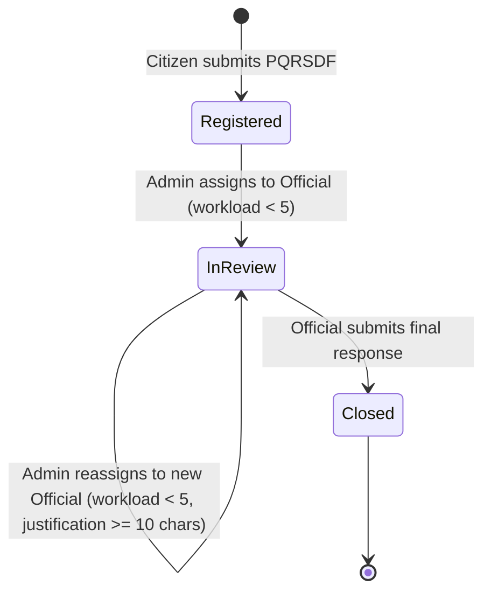

# Phase 1: Data Model & Schema Specifications

**Feature**: PQRSDF Ticket Assignment to Staff (`006-pqrsdf-assign-tickets`)  
**Status**: Completed  
**Date**: 2026-09-18  

---

## 1. Domain Entities & Value Objects

### 1.1 `PqrsdfTicket` (Aggregate Root Extension)

The `PqrsdfTicket` entity in `Domain/Entities/PqrsdfTicket.cs` is extended with assignment state attributes and domain invariants:

```csharp
namespace Pqrsdf.Domain.Entities;

public sealed class PqrsdfTicket : Entity<Guid>, IAggregateRoot
{
    // Existing fields
    public RadicadoNumber RadicadoNumber { get; private set; }
    public PqrsdfType Type { get; private set; }
    public Guid DestinationAreaId { get; private set; }
    public bool IsAnonymous { get; private set; }
    public Applicant? Applicant { get; private set; }
    public string Subject { get; private set; }
    public string Description { get; private set; }
    public DueDate DueDate { get; private set; }
    public TicketStatus Status { get; private set; }
    public string? ResponseText { get; private set; }
    public DateTime? ResponseDateUtc { get; private set; }

    // New Assignment attributes
    public Guid? AssignedToUserId { get; private set; }
    public DateTime? AssignedAtUtc { get; private set; }
    public string? AssignmentNote { get; private set; }

    // Domain Methods
    public Result AssignToOfficial(
        Guid officialId,
        Guid adminId,
        string? assignmentNote,
        int currentOfficialActiveWorkload,
        DateTime utcNow)
    {
        if (Status != TicketStatus.Registered)
        {
            return Result.Failure(Error.Conflict(
                "PqrsdfTicket.NotEligibleForAssignment",
                "Solo se pueden asignar solicitudes en estado Registrado."));
        }

        if (officialId == Guid.Empty)
        {
            return Result.Failure(Error.Validation(
                "PqrsdfTicket.InvalidOfficialId",
                "Debe seleccionar un funcionario válido."));
        }

        if (currentOfficialActiveWorkload >= 5)
        {
            return Result.Failure(Error.Conflict(
                "PqrsdfTicket.OfficialWorkloadLimitReached",
                "El funcionario seleccionado ha alcanzado el límite máximo de 5 solicitudes asignadas activas."));
        }

        if (assignmentNote != null && assignmentNote.Length > 500)
        {
            return Result.Failure(Error.Validation(
                "PqrsdfTicket.AssignmentNoteTooLong",
                "La nota de asignación no puede exceder los 500 caracteres."));
        }

        AssignedToUserId = officialId;
        AssignedAtUtc = utcNow;
        AssignmentNote = assignmentNote?.Trim();
        Status = TicketStatus.InReview;
        UpdatedAtUtc = utcNow;

        return Result.Success();
    }

    public Result ReassignToOfficial(
        Guid newOfficialId,
        Guid adminId,
        string justification,
        int targetOfficialActiveWorkload,
        DateTime utcNow)
    {
        if (Status != TicketStatus.InReview)
        {
            return Result.Failure(Error.Conflict(
                "PqrsdfTicket.NotEligibleForReassignment",
                "Solo se pueden reasignar solicitudes que se encuentren en estado En Trámite."));
        }

        if (newOfficialId == Guid.Empty)
        {
            return Result.Failure(Error.Validation(
                "PqrsdfTicket.InvalidOfficialId",
                "Debe seleccionar un funcionario válido para el traslado."));
        }

        if (AssignedToUserId.HasValue && AssignedToUserId.Value == newOfficialId)
        {
            return Result.Failure(Error.Conflict(
                "PqrsdfTicket.SameOfficialReassignment",
                "La solicitud ya se encuentra asignada a este funcionario."));
        }

        if (string.IsNullOrWhiteSpace(justification) || justification.Trim().Length < 10)
        {
            return Result.Failure(Error.Validation(
                "PqrsdfTicket.JustificationTooShort",
                "Debe ingresar un motivo de reasignación de al menos 10 caracteres."));
        }

        if (justification.Trim().Length > 500)
        {
            return Result.Failure(Error.Validation(
                "PqrsdfTicket.JustificationTooLong",
                "El motivo de reasignación no puede exceder los 500 caracteres."));
        }

        if (targetOfficialActiveWorkload >= 5)
        {
            return Result.Failure(Error.Conflict(
                "PqrsdfTicket.OfficialWorkloadLimitReached",
                "El funcionario seleccionado para reasignación ha alcanzado el límite de 5 solicitudes activas."));
        }

        AssignedToUserId = newOfficialId;
        AssignedAtUtc = utcNow;
        AssignmentNote = justification.Trim();
        UpdatedAtUtc = utcNow;

        return Result.Success();
    }
}
```

---

### 1.2 `TicketAssignmentHistory` (New Domain Entity)

An immutable audit record representing each assignment and transfer event:

```csharp
namespace Pqrsdf.Domain.Entities;

public enum AssignmentType
{
    InitialAssignment = 1,
    Reassignment = 2
}

public sealed class TicketAssignmentHistory : Entity<Guid>
{
    public Guid TicketId { get; private set; }
    public Guid? PreviousAssignedUserId { get; private set; }
    public Guid NewAssignedUserId { get; private set; }
    public Guid AssignedByUserId { get; private set; }
    public DateTime AssignedAtUtc { get; private set; }
    public string? Note { get; private set; }
    public AssignmentType Type { get; private set; }

    // Navigation properties for EF Core
    public PqrsdfTicket Ticket { get; private set; } = default!;
    public User? PreviousAssignedUser { get; private set; }
    public User NewAssignedUser { get; private set; } = default!;
    public User AssignedByUser { get; private set; } = default!;

    private TicketAssignmentHistory() { }

    public static Result<TicketAssignmentHistory> Create(
        Guid id,
        Guid ticketId,
        Guid? previousAssignedUserId,
        Guid newAssignedUserId,
        Guid assignedByUserId,
        DateTime assignedAtUtc,
        string? note,
        AssignmentType type)
    {
        if (id == Guid.Empty)
            return Result<TicketAssignmentHistory>.Failure(Error.Validation("History.InvalidId", "El ID no puede estar vacío."));

        if (ticketId == Guid.Empty)
            return Result<TicketAssignmentHistory>.Failure(Error.Validation("History.InvalidTicketId", "El radicado no es válido."));

        if (newAssignedUserId == Guid.Empty)
            return Result<TicketAssignmentHistory>.Failure(Error.Validation("History.InvalidNewUser", "El funcionario receptor no es válido."));

        if (assignedByUserId == Guid.Empty)
            return Result<TicketAssignmentHistory>.Failure(Error.Validation("History.InvalidAdmin", "El administrador no es válido."));

        return Result<TicketAssignmentHistory>.Success(new TicketAssignmentHistory
        {
            Id = id,
            TicketId = ticketId,
            PreviousAssignedUserId = previousAssignedUserId,
            NewAssignedUserId = newAssignedUserId,
            AssignedByUserId = assignedByUserId,
            AssignedAtUtc = assignedAtUtc,
            Note = note?.Trim(),
            Type = type
        });
    }
}
```

---

## 2. Relational Database Schema (EF Core / SQL Server)

### 2.1 Table: `PqrsdfTickets` (Modifications)

| Column | Type | Nullable | Description |
|---|---|:---:|---|
| `AssignedToUserId` | `uniqueidentifier` | YES | Foreign key referencing `Users(Id)` |
| `AssignedAtUtc` | `datetime2` | YES | UTC timestamp of the last assignment |
| `AssignmentNote` | `nvarchar(500)` | YES | Administrative instructions or transfer justification |

Indexes:
- `IX_PqrsdfTickets_AssignedToUserId_Status`: Composite index on `(AssignedToUserId, Status)` to optimize official inbox queries (`Status == InReview`) and workload count verification (`COUNT(*) WHERE AssignedToUserId = @id AND Status = 3`).
- `IX_PqrsdfTickets_Status_DueDate`: Composite index on `(Status, DueDate)` to optimize unassigned queue sorting and urgency filtering.

---

### 2.2 Table: `TicketAssignmentHistories` (New Table)

| Column | Type | Nullable | Description |
|---|---|:---:|---|
| `Id` | `uniqueidentifier` | NO | Primary Key |
| `TicketId` | `uniqueidentifier` | NO | Foreign Key -> `PqrsdfTickets(Id)` ON DELETE RESTRICT |
| `PreviousAssignedUserId` | `uniqueidentifier` | YES | Foreign Key -> `Users(Id)` ON DELETE RESTRICT |
| `NewAssignedUserId` | `uniqueidentifier` | NO | Foreign Key -> `Users(Id)` ON DELETE RESTRICT |
| `AssignedByUserId` | `uniqueidentifier` | NO | Foreign Key -> `Users(Id)` (Admin) ON DELETE RESTRICT |
| `AssignedAtUtc` | `datetime2` | NO | UTC event timestamp |
| `Note` | `nvarchar(500)` | YES | Administrative note / justification |
| `Type` | `int` | NO | 1 = InitialAssignment, 2 = Reassignment |

Indexes:
- `IX_TicketAssignmentHistories_TicketId_AssignedAtUtc`: Fast retrieval of a ticket's audit chronology.

---

## 3. Invariants and State Transitions



### Workload Invariant
$$\forall \text{ official } u \in \text{Users} \text{ where } u.\text{Role} = \text{Funcionario}: \quad \text{Count}(\text{Tickets assigned to } u \text{ with Status} = \text{InReview}) \le 5$$

If $\text{Count} = 5$:
- User is marked with `CanAssign = false` in the selection catalog.
- Any assignment attempt fails with `409 Conflict`.
