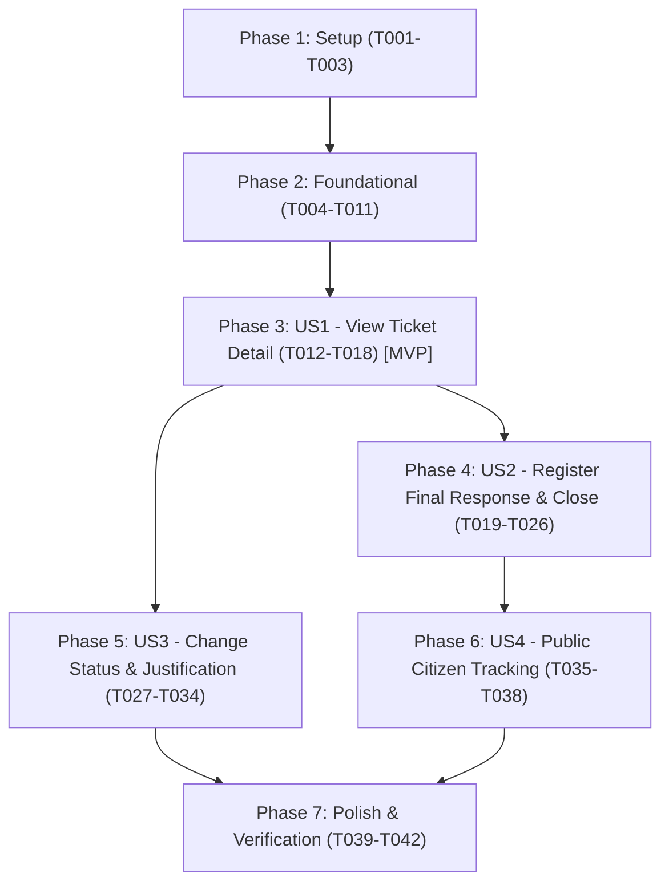

# Tasks: PQRSDF Ticket Management and Official Response (007-pqrsdf-response-tickets)

**Input**: Design documents from `specs/007-pqrsdf-response-tickets/` (`spec.md`, `plan.md`, `data-model.md`, `research.md`, `contracts/`, `quickstart.md`)  
**Prerequisites**: `plan.md` (complete), `spec.md` (complete), `data-model.md` (complete), `contracts/` (complete), `quickstart.md` (complete)  
**Organization**: Tasks are grouped by user story to enable independent implementation and testing of each story.

## Format: `[ID] [P?] [Story] Description`
- **[P]**: Can run in parallel (different files, no blocking dependencies)
- **[Story]**: Which user story this task belongs to (`US1`, `US2`, `US3`, `US4`)
- Includes exact file paths in all descriptions

---

## Phase 1: Setup (Shared Infrastructure)

**Purpose**: Localization strings, client contract types, and shared domain constants

- [ ] T001 Add Spanish localization messages for ticket management (drawer headers, response form, justification field, min/max length validation alerts, closure confirmation, and audit history labels) in `frontend/messages/es.json`
- [ ] T002 [P] Create frontend TypeScript contract types for ticket management detail, status update request/response, and official response submission in `frontend/src/app/dashboard/types/ticket-management.types.ts`
- [ ] T003 [P] Add domain error messages and validation constants for ticket response and status history in `backend/src/Domain/Constants/DomainMessages.cs`

---

## Phase 2: Foundational (Blocking Prerequisites)

**Purpose**: Core domain audit entity, aggregate invariant methods, repository interfaces, and EF Core database persistence

**⚠️ CRITICAL**: No user story work can begin until this phase is complete.

- [ ] T004 Create `TicketStatusHistory` immutable audit domain entity with TicketId, PreviousStatus, NewStatus, ChangedByUserId, Justification, and ChangedAtUtc in `backend/src/Domain/Entities/TicketStatusHistory.cs`
- [ ] T005 [P] Extend `PqrsdfTicket` aggregate root with `ChangeOperationalStatus` domain method and verify `CloseWithResponse` invariant enforcement in `backend/src/Domain/Entities/PqrsdfTicket.cs`
- [ ] T006 [P] Define `ITicketStatusHistoryRepository` repository contract with methods to persist and retrieve audit history by ticket in `backend/src/Domain/Repositories/ITicketStatusHistoryRepository.cs`
- [ ] T007 [P] Configure EF Core mapping for `TicketStatusHistory` with foreign keys to `PqrsdfTickets` and `Users` plus descending timestamp indexes in `backend/src/Infrastructure/Persistence/Configurations/TicketStatusHistoryConfiguration.cs`
- [ ] T008 Register `DbSet<TicketStatusHistory>` in `backend/src/Infrastructure/Persistence/PqrsdfDbContext.cs`
- [ ] T009 Implement `TicketStatusHistoryRepository` with EF Core persistence in `backend/src/Infrastructure/Persistence/Repositories/TicketStatusHistoryRepository.cs`
- [ ] T010 Register `ITicketStatusHistoryRepository` in `backend/src/Infrastructure/DependencyInjection.cs`
- [ ] T011 Create and apply EF Core database migration for `TicketStatusHistories` table in `backend/src/Infrastructure/Migrations/`

**Checkpoint**: Foundation ready - Domain audit entity, aggregate methods, repository contracts, and database schema are in place.

---

## Phase 3: User Story 1 - View Full Ticket Detail from Official Inbox (Priority: P1) 🎯 MVP

**Goal**: Allow authenticated Officials (`Funcionario`) and Administrators to open the full operational and citizen details of an assigned ticket directly from their inbox table, displaying radicado, category, citizen narrative, applicant information (if not anonymous), due date, SLA badge, and assignment notes.

**Independent Test**: Can be tested independently by logging in as an Official, selecting an assigned ticket in `/dashboard`, verifying that the management drawer opens showing full citizen details, and confirming that non-assigned officials cannot edit.

### Tests for User Story 1
- [ ] T012 [P] [US1] Unit tests for `GetTicketManagementDetailQueryHandler` (verifying role authorization, ownership check, applicant data exposure, and 404/403 responses) in `backend/tests/Application.UnitTests/Features/Pqrsdf/GetTicketManagementDetailQueryHandlerTests.cs`

### Implementation for User Story 1
- [ ] T013 [P] [US1] Create `GetTicketManagementDetailQuery` and `TicketManagementDetailDto` with applicant contact details and history in `backend/src/Application/Features/Pqrsdf/UseCases/GetTicketManagementDetail/GetTicketManagementDetailQuery.cs`
- [ ] T014 [US1] Implement `GetTicketManagementDetailQueryHandler` enforcing ownership check (`AssignedToUserId == CurrentUserId || Admin`) and mapping ticket details in `backend/src/Application/Features/Pqrsdf/UseCases/GetTicketManagementDetail/GetTicketManagementDetailQueryHandler.cs`
- [ ] T015 [US1] Create `TicketsManagementController` and expose `GET /api/v1/tickets/{radicado}/management-detail` protected by `[Authorize(Roles = "Funcionario,Administrador")]` in `backend/src/Api/Controllers/V1/TicketsManagementController.cs`
- [ ] T016 [P] [US1] Add `getTicketManagementDetail` method to API client in `frontend/src/shared/api/client.ts`
- [ ] T017 [P] [US1] Create `ManageTicketDrawer` slide-over component with ticket metadata, SLA badge, citizen description, and applicant contact card in `frontend/src/app/dashboard/components/ManageTicketDrawer.tsx`
- [ ] T018 [US1] Update `OfficialInboxTable.tsx` to open `ManageTicketDrawer` when clicking "Gestionar" or selecting a ticket row in `frontend/src/app/dashboard/components/OfficialInboxTable.tsx`

**Checkpoint**: At this point, User Story 1 (MVP) is fully functional and testable independently. Officials can inspect full operational details from their dashboard inbox.

---

## Phase 4: User Story 2 - Register Final Official Response and Close Ticket (Priority: P1)

**Goal**: Allow the assigned official (or Administrator) to write and submit a formal institutional response (10 to 4,000 characters), transitioning the ticket to `Closed`, setting the response timestamp, permanently freezing SLA calculation, recording an audit entry, and decrementing the official's active workload count.

**Independent Test**: Can be tested independently by opening an assigned ticket, submitting a valid response, verifying that the ticket transitions to `Closed`, SLA calculation halts, workload decreases from e.g. 5/5 to 4/5, and subsequent edits return a conflict error.

### Tests for User Story 2
- [ ] T019 [P] [US2] Unit tests for `PqrsdfTicket.CloseWithResponse` domain method (length validation 10-4000 chars, status change to Closed, conflict if already closed) in `backend/tests/Domain.UnitTests/Entities/PqrsdfTicketResponseTests.cs`
- [ ] T020 [P] [US2] Unit tests for `RespondTicketCommandHandler` (ownership authorization, persistence of response, audit log creation, error scenarios) in `backend/tests/Application.UnitTests/Features/Pqrsdf/RespondTicketCommandHandlerTests.cs`

### Implementation for User Story 2
- [ ] T021 [P] [US2] Create `RespondTicketCommand`, `RespondTicketRequestDto`, and `RespondTicketResponseDto` in `backend/src/Application/Features/Pqrsdf/UseCases/RespondTicket/RespondTicketCommand.cs`
- [ ] T022 [US2] Implement `RespondTicketCommandHandler` validating permissions, invoking `CloseWithResponse`, persisting audit record in `TicketStatusHistories`, and saving changes in `backend/src/Application/Features/Pqrsdf/UseCases/RespondTicket/RespondTicketCommandHandler.cs`
- [ ] T023 [US2] Expose `POST /api/v1/tickets/{radicado}/response` in `backend/src/Api/Controllers/V1/TicketsManagementController.cs`
- [ ] T024 [P] [US2] Add `respondTicket` method to API client in `frontend/src/shared/api/client.ts`
- [ ] T025 [P] [US2] Create `TicketResponseForm` component with live character counter (10-4,000 characters), validation feedback, and confirmation dialog in `frontend/src/app/dashboard/components/TicketResponseForm.tsx`
- [ ] T026 [US2] Integrate `TicketResponseForm` into `ManageTicketDrawer.tsx` and trigger inbox table refresh and workload badge update upon successful response in `frontend/src/app/dashboard/components/ManageTicketDrawer.tsx`

**Checkpoint**: User Stories 1 AND 2 are fully functional. The complete end-to-end response and closure lifecycle is operational.

---

## Phase 5: User Story 3 - Change Ticket Status with Mandatory Justification (Priority: P2)

**Goal**: Allow authorized staff to update the operational status of an assigned ticket while providing a mandatory justification note (10 to 500 characters), recording an immutable audit entry in `TicketStatusHistories` viewable inside the management drawer.

**Independent Test**: Can be tested independently by opening an assigned ticket, submitting a status update without justification (verifying client and server rejection), submitting with valid justification (≥ 10 chars), and verifying that the updated status and justification appear in the drawer's history list.

### Tests for User Story 3
- [ ] T027 [P] [US3] Unit tests for `ChangeTicketStatusCommandHandler` (justification validation ≥ 10 chars, status transition to InReview, audit record insertion) in `backend/tests/Application.UnitTests/Features/Pqrsdf/ChangeTicketStatusCommandHandlerTests.cs`

### Implementation for User Story 3
- [ ] T028 [P] [US3] Create `ChangeTicketStatusCommand`, `ChangeTicketStatusRequestDto`, and `ChangeTicketStatusResponseDto` in `backend/src/Application/Features/Pqrsdf/UseCases/ChangeTicketStatus/ChangeTicketStatusCommand.cs`
- [ ] T029 [US3] Implement `ChangeTicketStatusCommandHandler` checking ownership, enforcing mandatory justification, calling `ChangeOperationalStatus`, and logging to `TicketStatusHistories` in `backend/src/Application/Features/Pqrsdf/UseCases/ChangeTicketStatus/ChangeTicketStatusCommandHandler.cs`
- [ ] T030 [US3] Expose `POST /api/v1/tickets/{radicado}/status` in `backend/src/Api/Controllers/V1/TicketsManagementController.cs`
- [ ] T031 [P] [US3] Add `changeTicketStatus` method to API client in `frontend/src/shared/api/client.ts`
- [ ] T032 [P] [US3] Create `TicketStatusForm` component with operational status selector, mandatory justification textarea (10-500 chars), and submit action in `frontend/src/app/dashboard/components/TicketStatusForm.tsx`
- [ ] T033 [P] [US3] Create `TicketStatusHistoryList` component rendering historical timeline of status updates, responsible official names, and justifications in `frontend/src/app/dashboard/components/TicketStatusHistoryList.tsx`
- [ ] T034 [US3] Integrate `TicketStatusForm` and `TicketStatusHistoryList` as tabs in `ManageTicketDrawer.tsx` in `frontend/src/app/dashboard/components/ManageTicketDrawer.tsx`

**Checkpoint**: User Stories 1, 2, and 3 are functional. Operational status changes with audit history are fully integrated.

---

## Phase 6: User Story 4 - Citizen Real-Time Tracking of Status and Resolution (Priority: P2)

**Goal**: Ensure that once an official registers a final response, a citizen querying their radicado number in the public portal (`/pqrsdf/search`) immediately views the "Cerrado" status badge, full institutional response text, resolution date, and completed timeline without exposure of internal audit notes.

**Independent Test**: Can be tested independently by querying a closed ticket on `/pqrsdf/search` and verifying that the resolution text and closure date render, SLA calculation is frozen, and internal staff justifications are completely hidden.

### Tests for User Story 4
- [ ] T035 [P] [US4] Integration unit tests for `GetTicketByRadicadoQueryHandler` asserting that closed tickets return `TicketResolutionDto`, completed milestones, and no active overdue accrual in `backend/tests/Application.UnitTests/Features/Pqrsdf/GetTicketByRadicadoResolutionTests.cs`

### Implementation for User Story 4
- [ ] T036 [US4] Verify and ensure that `GetTicketByRadicadoQueryHandler.cs` returns `TicketResolutionDto` with `ResponseText` and `ResponseDate` when `Status == Closed`, and hides internal justification fields in `backend/src/Application/Features/Pqrsdf/UseCases/GetTicketByRadicado/GetTicketByRadicadoQueryHandler.cs`
- [ ] T037 [P] [US4] Verify and refine `TicketResolutionCard.tsx` under `frontend/src/app/pqrsdf/search/components/TicketResolutionCard.tsx` to display official institutional response text, formal delivery date, and closed status badge
- [ ] T038 [US4] Ensure `TicketTimeline.tsx` marks the final resolution milestone as completed when status is `Closed` in `frontend/src/app/pqrsdf/search/components/TicketTimeline.tsx`

**Checkpoint**: All 4 user stories are complete and validated.

---

## Phase 7: Polish & Cross-Cutting Concerns

**Purpose**: End-to-end flow validation, error boundary resilience, and automated verification

- [ ] T039 Execute complete automated test suites across backend and frontend per `specs/007-pqrsdf-response-tickets/quickstart.md`
- [ ] T040 [P] Verify error boundary and network failure handling in `ManageTicketDrawer.tsx` and `OfficialInboxTable.tsx`
- [ ] T041 Validate that all user-facing UI labels, form validations, and alerts are strictly in Spanish and source code comments/identifiers are in English
- [ ] T042 Run linter and type-checks (`dotnet build --warnaserror`, `npm run lint`) across backend and frontend repositories

---

## Dependencies & Execution Sequence

### Story Completion Order
1. **Foundational Phase**: Must complete before any user story can start.
2. **User Story 1 (P1 - MVP)**: Enables detail inspection and drawer infrastructure; prerequisite for editing.
3. **User Story 2 (P1)**: Completes the core value proposition of formal institutional response and case closure.
4. **User Story 3 (P2)**: Extends management with in-progress operational updates and audit history.
5. **User Story 4 (P2)**: Validates and refines public citizen tracking transparency for closed cases.
6. **Polish Phase**: Final quality verification and automated test execution.

---

## Parallel Execution Opportunities

### Phase 1 & 2 (Setup & Foundational)
- `T002` (Frontend types) can run in parallel with `T003` (Domain constants) and `T004` (Entity).
- `T006` (Repository interface) and `T007` (EF configuration) can run in parallel.

### User Story 1
- `T012` (Unit tests) and `T013` (Query definition) can run in parallel.
- `T016` (API client) and `T017` (Drawer component) can run in parallel with backend endpoint implementation `T015`.

### User Story 2
- `T019` (Domain tests) and `T020` (Handler tests) can run in parallel with `T021` (Command DTOs).
- `T024` (API client) and `T025` (Response form) can run in parallel with `T023` (Controller endpoint).

### User Story 3
- `T027` (Handler tests) and `T028` (Command DTOs) can run in parallel.
- `T031` (API client), `T032` (Status form), and `T033` (History list) can run in parallel.
